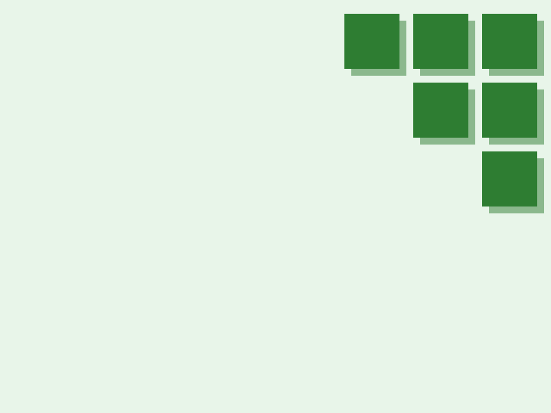

# Specific wallpaper generator
A wallpaper generator that parametrically generates a specific wallpaper
## Features
- Want the wallpaper in a different size? Adjust the width and height property
- Boxes too big or small? just change the box size property
- Shadows too dark? You can change that too
- Color schemes? We've got 11 different palettes already predefined for you
## Requirements
- [Racket](https://racket-lang.org)
## Instructions
- Get the .rkt files, either by pulling this repo or copying those files specifically
- Open config.rkt in DrRacket and adjust the settings as required
- Open wallpaper.rkt in DrRacket and click run
- Wallpaper will output as wallpaper.png
## Palettes

