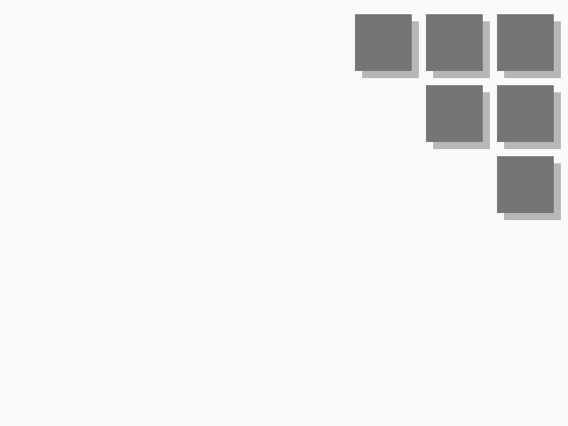

# Specific wallpaper generator
A wallpaper generator that parametrically generates a specific wallpaper
## Features
- Want the wallpaper in a different size? Adjust the width and height property
- Boxes too big or small? just change the box size property
- Shadows too dark? You can change that too
- Color schemes? We've got 11 different palettes already predefined for you
## Requirements
- [Racket](https://racket-lang.org)
## Instructions
- Get the .rkt files, either by pulling this repo or copying those files specifically
- Open config.rkt in DrRacket and adjust the settings as required
- Open wallpaper.rkt in DrRacket and click run
- Wallpaper will output as a png file.
## Palettes

## Options
Options which can be configured in config.rkt:
### Width
Valid input: A natural number
Width of the wallpaper. This should be the width of your screen
### Height
Valid input: A natural number
Height of the wallpaper. This should be the height of your screen
### Horizontal-Margin
Valid input: An integer
Amount by which to push the pattern left, to move it out the way of any dock on the right side of the screen
### Vertical-Margin
Valid input: An integer
Amount by which to push the pattern down, to move it out the way of any dock on the top of the screen
### Box-Size
Valid input: A natural number
Size of the boxes in the pattern, in pixels
### Box-Gap
Valid input: A natural number
Size of the space between the boxes in the pattern, in pixels
### Shadow-Size
Valid input: A natural number
Size of the drop-shadow on each of the boxes in the pattern, in pixels
### Shadow-Darkness
Valid input: A decimal number between 0 and 1
This actually determines the opacity of the drop-shadow. 1 = same colour as the box, 0 = same colour as the background
### Palette
Valid input: A symbol structured palette-x for a palette named x
Use this palette, as defined in palette.rkt. Note that the comma is required.
For example, if you want the red palette you would have ",palette-red" here.
### Palette-swap
Valid input: A scheme boolean (#t for true, #f for false)
Swap background and box colours. Would probably look nicer with a dark theme or something idk
